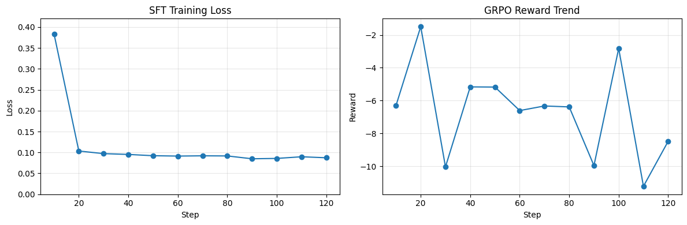
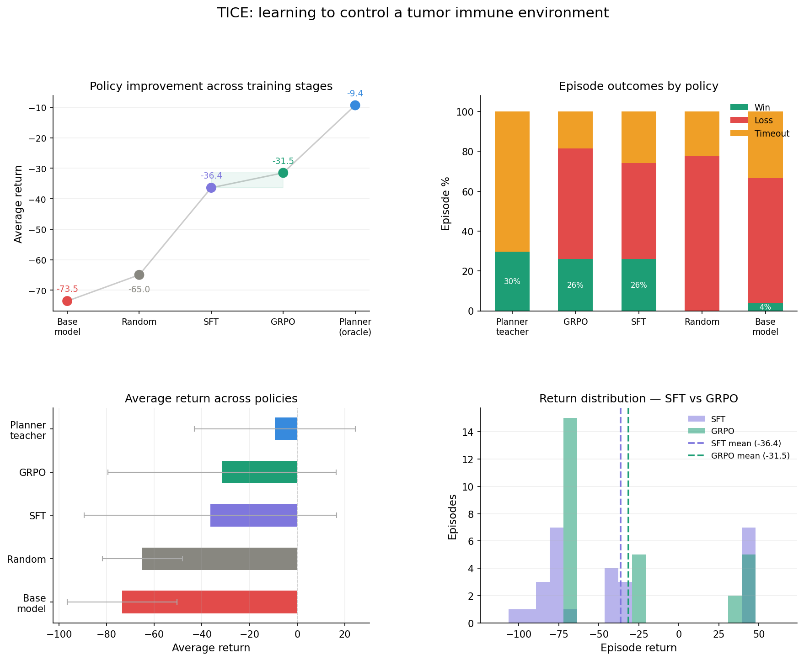

# TICE

Tumor Immune Control Environment (TICE) is an OpenEnv reinforcement learning environment where an LLM learns to coordinate immune cells against an evolving tumor under partial observability.


This makes TICE a compact but meaningful test of three things current LLMs still struggle with:

1. long-horizon planning
2. subsystem coordination
3. reasoning under hidden state

## The Problem

Most LLM environments are short-horizon, fully observable, and forgiving. TICE targets a harder capability gap:

- planning over 50-step episodes
- coordinating interdependent subsystems
- acting under hidden state and noisy signals
- managing the tradeoff between aggression and resource conservation

The biological theme is intentional, but the real target is general agent capability. The orchestrator never sees the tumor directly. It has to infer what is happening from indirect signals, then decide how to use a detection subsystem and an attack subsystem before the tumor adapts.

## The Environment

Every episode begins with a tumor sampled from TCGA-inspired distributions derived from real cancer cohorts. TICE currently exposes three archetypes:

- `immune_hot`: easier to detect, but still dangerous if you waste time
- `immune_cold`: hard to detect and harder to attack effectively
- `high_mutation`: adapts quickly and punishes rigid policies

Concretely, tumor parameters are sampled from archetype-specific distributions inspired by:

- `immune_hot`: Skin Cutaneous Melanoma (SKCM), \(n=440\)
- `immune_cold`: Glioblastoma Multiforme (GBM), \(n=397\)
- `high_mutation`: top 25% TMB cohort from SKCM, \(n=110\)

The sampler draws tumor mutational burden (TMB) and mutation count from lognormal distributions, and genomic instability from a normal distribution (clipped to \([0, 1]\)). Difficulty (`easy`, `medium`, `hard`) scales downstream dynamics, and additional quantities like visibility and suppression are derived from these draws with noise.

The agent controls two linked subsystems:

- **B cells** build and maintain tumor detection
- **T cells** attack the tumor

The action space is deliberately compact: 4 B-cell actions × 4 T-cell actions = 16 joint decisions per step.

### What the agent sees

The agent does not get true tumor state. It only sees a partial observation:

- tumor trend
- noisy detection signal
- T-cell effectiveness bucket
- resource level
- B-cell fatigue
- T-cell fatigue
- recent outcome
- timestep and episode phase
- archetype and difficulty

This makes TICE a world-modeling problem, not just a control problem.

### What the agent does

At each timestep, the orchestrator chooses:

- a B-cell command: `INCREASE_HIGH`, `INCREASE_LOW`, `MAINTAIN`, or `REDUCE`
- a T-cell command: `ATTACK_HIGH`, `ATTACK_MEDIUM`, `ATTACK_LOW`, or `REST`

These actions matter only through the system dynamics:

- detection boosts downstream attack quality
- fatigue reduces effectiveness
- exhaustion downgrades T-cell aggression
- the tumor can mutate into stealth, resistance, faster growth, or stronger suppression

### What the agent is rewarded for

The reward function pushes toward coordinated, efficient immune control:

- positive reward for tumor reduction
- large bonus for eradication
- large penalty for tumor escape
- penalties for B-cell fatigue, T-cell fatigue, tissue damage, wasted energy, and time

That means naive policies fail for understandable reasons:

- pure aggression burns out T cells
- pure passivity lets the tumor escape
- building detection without converting it into attacks wastes resources

## What changed after training?

We trained a compact text-only model in three stages:

1. **Base model**: no task-specific adaptation
2. **SFT**: supervised fine-tuning on planner-generated demonstrations
3. **GRPO**: reward-driven refinement using TICE reward tables



SFT loss drops quickly and stabilizes, while GRPO reward is noisier step to step but reflects the same shift toward better environment-specific behavior.



### Evaluation summary

Across 27 held-out episodes:

| Policy | Avg return | Win rate | Loss rate | Timeout rate | Avg final tumor |
|---|---:|---:|---:|---:|---:|
| Planner teacher | -9.37 | 29.6% | 0.0% | 70.4% | 0.612 |
| GRPO model | -31.52 | 25.9% | 55.6% | 18.5% | 0.676 |
| SFT model | -36.40 | 25.9% | 48.1% | 25.9% | 0.630 |
| Random | -64.96 | 0.0% | 77.8% | 22.2% | 0.927 |
| Base model | -73.54 | 3.7% | 63.0% | 33.3% | 0.852 |

### The key improvement story

- **SFT vs base**
  - return improved by `+37.13`
  - win rate improved by `+22.2 percentage points`
  - average final tumor size dropped by `0.222`

- **GRPO vs base**
  - return improved by `+42.02`
  - win rate improved by `+22.2 percentage points`
  - timeout rate dropped by `14.8 percentage points`
  - average final tumor size dropped by `0.176`

- **GRPO vs SFT**
  - return improved by `+4.88`
  - timeout rate dropped by `7.4 percentage points`

The strongest takeaway is not that the learned policy beats the planner teacher. It does not. The takeaway is that a compact text policy moved from near-failure (`3.7%` wins) to meaningful competence (`25.9%` wins) in a partially observable, multi-step control setting with coherent reward shaping.

## Why this matters

TICE is useful for anyone interested in training agents that must:

- plan across long horizons
- coordinate multiple subsystems instead of picking one-shot answers
- infer hidden state from noisy observations
- adapt when the world changes underneath them

That makes it relevant beyond the biological theme. The same structure shows up in operations, robotics, scientific workflows, and decision support systems where the agent cannot directly observe the full system state and still has to act well.

## Why this environment is interesting

From a benchmark design perspective, TICE combines four things that are rarely present together:

- a compact action space that compact policies can learn
- meaningful hidden state
- nontrivial reward shaping
- real-data-inspired episode diversity


## Try it

Run the environment locally:

```bash
cd tice
uvicorn server.app:app --host 0.0.0.0 --port 8000
```

Run the LLM-driven inference client (make sure to set the ENV variables):

```bash
python inference.py
```

Training and evaluation notebooks:

- `tice_sft_grpo_training_final.ipynb`


## Where the core logic lives

If you want to understand the “theory” of the environment from code, these are the main files:

- `data/tcga_params.py` + `data/sampler.py`: TCGA-inspired archetype distributions and episode sampling
- `core/tumor.py`: tumor growth, resistance, mutation, and suppression dynamics
- `core/b_cell.py` + `core/t_cell.py`: detection and attack subsystem dynamics (including fatigue/energy)
- `core/reward.py`: reward shaping (tumor reduction, eradication/escape terms, and resource/damage costs)
- `server/tice_environment.py`: ties dynamics, observations, actions, and termination into the OpenEnv environment

## Repo structure

```text
tice/
├── core/                   # tumor, B-cell, T-cell, reward logic
├── data/                   # TCGA-inspired parameter sampling
├── server/                 # OpenEnv server implementation (FastAPI)
├── tice_benchmark_outputs/ # evaluation CSVs / harness outputs
├── client.py               # OpenEnv client (Python)
├── inference.py            # LLM-driven agent loop
├── models.py               # action/observation schema (Pydantic)
├── Dockerfile              # container build for server deployment
├── openenv.yaml            # OpenEnv/HF metadata
├── pyproject.toml          # dependencies (uv/PEP 621)
└── tice_sft_grpo_training_final.ipynb
```
